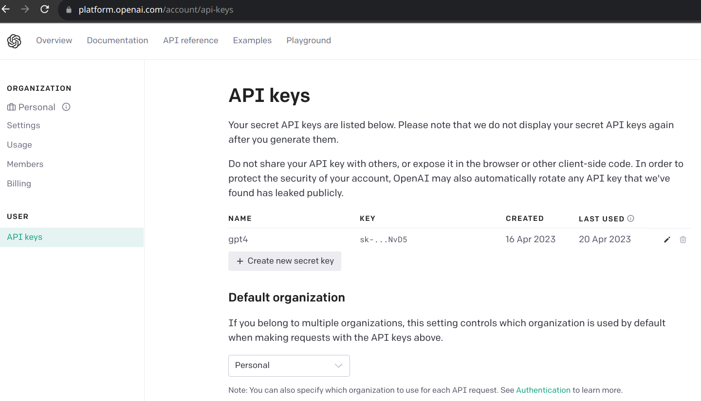

# GPT-4 Command Executor

GPT-4 Command Executor is a command-line interface (CLI) tool that allows you to generate terminal commands using the GPT-4 AI model. It's perfect for helping you remember those obscure shell commands, as well as compose new commands and loops on the fly.

## ⚠️ Warning

Executing commands generated by an AI model may lead to unexpected results and security risks. Always review and approve the commands before allowing them to execute.

## Features

- Interact with OpenAI's GPT-4 model to generate terminal commands
- Execute commands locally using the Python `subprocess` library
- Store API keys securely using environment variables and `python-dotenv`

## Requirements

- Python 3.6 or higher
- An OpenAI API key (register at https://beta.openai.com/signup/)
- Create new secret key (https://platform.openai.com/account/api-keys)
- 

## Installation

1. Clone the repository
2. `pip install --user .`
3. `export PATH=$PATH:$HOME/.local/bin`
4. `export OPENAI_API_KEY=<your API key>`

## Cost per Usage

Keep in mind that this tool utilizes OpenAI's GPT, which has a cost associated with it.
The average cost per script execution (2 queries with 25 tokens each) is approximately $0.00005,
while the extreme case (2 queries with 50 tokens each) is around $0.00010.
Please be aware of this cost when using the tool frequently.
Note that OpenAI charges are based on the number of tokens used, and billing is done at the end of the month.

## Contributing

Contributions are welcome! Please feel free to submit a Pull Request or create an Issue if you encounter any problems or have suggestions for improvements.

## License

This project is licensed under the MIT License. See the LICENSE file for more information.
